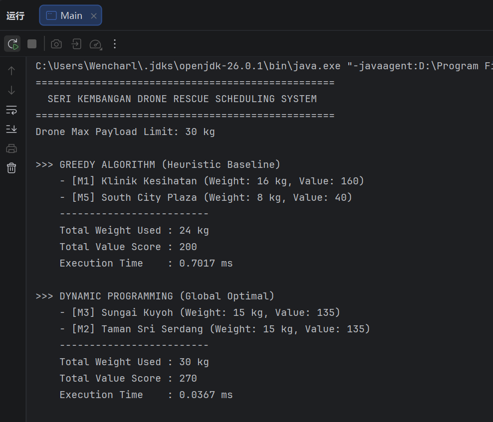

# 🚁 Apex Algorithms - Drone Rescue Scheduling System


This project is a Java-based simulation for solving a critical emergency resource allocation problem, formally modeled as a **0/1 Knapsack Problem**. It cross-evaluates a fast, heuristic-based **Greedy Algorithm** against a globally optimal **Dynamic Programming** solution.

## 👥 Team Members (Apex Algorithms)
* **PING WENCHAO (226969)** - Project Lead & DP Developer
* **CHEN SHUAIPENG (228163)** - Co-Lead & Greedy Developer
* **PAN ZIHENG (226922)** - Data Modeler
* **SHENG JIAWEI (226994)** - Complexity Analyst
* **DAI QIANXIANG (218356)** - Portfolio Manager

---

## 📖 The Scenario

During a severe monsoon flash flood in Seri Kembangan, emergency response teams must deploy heavy-lift rescue drones with a strict payload limit of **30 kg** to deliver critical supplies from the UPM Bukit Ekspo unflooded hub. Each supply mission carries a specific weight and an intrinsic "survival priority" value.

The challenge is to select the exact combination of missions that maximizes the total survival priority value for each drone flight without exceeding its hardware weight capacity. This project demonstrates how different algorithmic paradigms lead to vastly different survival outcomes.


## 📋 Prerequisites

- Java Development Kit (JDK) 8 or higher

## 📂 Project Structure

```text
.
└── src
    └── apexalgorithms
        ├── Main.java            # Main entry point, runs the simulation and contrasts metrics.
        ├── Mission.java         # Entity data model for a localized rescue mission.
        ├── GreedyScheduler.java # Implements the heuristic Greedy approach.
        └── DPScheduler.java     # Implements the optimal DP approach.
```

## 🚀 How to Compile and Run

1. Open a terminal and navigate to the project's `src` directory.
2. Compile the Java source files:
   ```bash
   javac apexalgorithms/*.java
   ```
3. Execute the main program:
   ```bash
   java apexalgorithms.Main
   ```

## 📊 Demonstration & Output

The program output empirically demonstrates the "Greedy Trap". The Greedy algorithm selects the mission with the highest local density first, scoring only **200**. Dynamic Programming explores all states and finds the true global optimal combination, scoring **270**.

```text
==================================================
  SERI KEMBANGAN DRONE RESCUE SCHEDULING SYSTEM  
==================================================
Drone Max Payload Limit: 30 kg

>>> GREEDY ALGORITHM (Heuristic Baseline)
    - [M1] Klinik Kesihatan (Weight: 16 kg, Value: 160)
    - [M5] South City Plaza (Weight: 8 kg, Value: 40)
    -------------------------
    Total Weight Used : 24 kg
    Total Value Score : 200
    Execution Time    : 0.7017 ms

>>> DYNAMIC PROGRAMMING (Global Optimal)
    - [M3] Sungai Kuyoh (Weight: 15 kg, Value: 135)
    - [M2] Taman Sri Serdang (Weight: 15 kg, Value: 135)
    -------------------------
    Total Weight Used : 30 kg
    Total Value Score : 270
    Execution Time    : 0.0367 ms
```



## 🧮 Problem Definition: 0/1 Knapsack

This scenario is mathematically modeled as a classic 0/1 Knapsack problem:

- **Items**: The localized rescue missions, each carrying a `weight` ($w_i$) and a `priorityValue` ($v_i$).
- **Knapsack**: The heavy-lift drone, constrained by a maximum capacity ($W$).
- **Objective**: Maximize the sum of `priorityValue` for the chosen missions, subject to the absolute constraint that the sum of their weights does not exceed the `maxPayload`.

$$
\text{maximize} \sum_{i=1}^{n} v_i x_i
$$
$$
\text{subject to} \sum_{i=1}^{n} w_i x_i \le W \quad \text{and} \quad x_i \in \{0, 1\}
$$

## ⚙️ Algorithms Implemented

Two distinct algorithmic paradigms are implemented and contrasted:

### 1. Greedy Algorithm (`GreedyScheduler.java`)
- **Strategy**: Sorts all missions in descending order based on their value-to-weight density ratio ($v_i / w_i$). It iterates through the sorted list, packing missions sequentially as long as they fit within the remaining payload capacity.
- **Characteristics**: Executes rapidly but focuses purely on local optima. It easily falls into the "Greedy Trap" by selecting bulky high-ratio items, failing to find the global optimal solution.

#### Pseudocode
```plaintext
FUNCTION GreedySchedule(missions, maxWeight):
  // Sort missions by priority/weight ratio in descending order
  SORT missions based on (mission.priority / weight) DESC

  selectedMissions = new List()
  currentWeight = 0

  FOR EACH mission IN missions:
    IF (currentWeight + mission.weight) <= maxWeight:
      ADD mission to selectedMissions
      currentWeight = currentWeight + mission.weight
    END IF
  END FOR

  RETURN selectedMissions
END FUNCTION
```

### 2. Dynamic Programming (`DPScheduler.java`)
- **Strategy**: Utilizes a bottom-up 2D tabulation matrix (`dp[i][w]`). It evaluates overlapping subproblems using a strict recurrence relation, evaluating every possible capacity state.
- **Characteristics**: Systematically bypasses heuristic traps and mathematically guarantees the absolute global optimal solution.

#### Pseudocode
```plaintext
FUNCTION DPSchedule(missions, maxWeight):
  n = number of missions
  dp = new 2D_Array[n + 1][maxWeight + 1]

  FOR i FROM 1 TO n:
    mission = missions[i - 1]
    FOR w FROM 1 TO maxWeight:
      IF mission.weight > w:
        dp[i][w] = dp[i - 1][w]
      ELSE:
        priority_if_included = mission.priority + dp[i - 1][w - mission.weight]
        priority_if_excluded = dp[i - 1][w]
        dp[i][w] = MAX(priority_if_included, priority_if_excluded)
      END IF
    END FOR
  END FOR

  // Backtrack to find selected missions
  selectedMissions = new List()
  w = maxWeight
  FOR i FROM n DOWN TO 1:
    IF dp[i][w] != dp[i - 1][w]:
      mission = missions[i - 1]
      ADD mission to selectedMissions
      w = w - mission.weight
    END IF
  END FOR
  
  RETURN selectedMissions
END FUNCTION
```

## 🔬 Algorithm Analysis (Correctness & Complexity)

### 1. Correctness Analysis

**Why Greedy Fails (The Local Optimum Trap):**
The Greedy approach selects items strictly based on the highest local density ($v_i / w_i$). In our scenario, the algorithm eagerly picked mission **M1** (Ratio = 10.0), consuming 16 kg. This left only 14 kg of capacity, locking out the highly valuable combination of **M2** (15 kg) and **M3** (15 kg). Greedy satisfies the immediate step but fails to possess an optimal substructure for the 0/1 Knapsack problem under rigid capacity boundaries, scoring only 200.

**Why Dynamic Programming Succeeds (Global Optimal Guarantee):**
DP guarantees correctness via Bellman’s Principle of Optimality. By utilizing the recurrence relation, the algorithm systematically evaluates both the inclusion and exclusion of every mission across all incremental weight limits. It backtracks through the 2D tabulation matrix to confidently output the absolute global maximum (Score: 270).

The recurrence relation is defined as:
$$
DP[i][w] = \max(DP[i-1][w], \quad v_i + DP[i-1][w-w_i])
$$

### 2. Time & Space Complexity

| Algorithm               | Time Complexity | Space Complexity | Explanation                                                                                                                                 |
|:------------------------|:----------------|:-----------------|:--------------------------------------------------------------------------------------------------------------------------------------------|
| **Greedy Algorithm**    | $O(n \log n)$   | $O(n)$           | Dominated by the Timsort mechanism used in Java's `Comparator` to sort the `n` missions by density ratio.                                   |
| **Dynamic Programming** | $O(n \cdot W)$  | $O(n \cdot W)$   | Requires nested loops to populate the 2D matrix of size $n \times W$, where $n$ is the number of missions and $W$ is the max payload limit. |

## 📜 License

This project is licensed under the MIT License.
